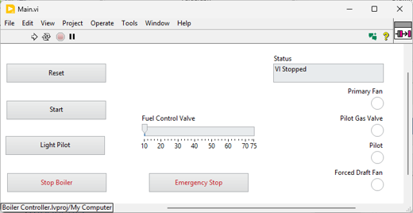

# Content for GDEVCON - North America 2026

This repo is a convenient place to keep the code for my 2026 GDevConNA presentation.

🎬 The presentation recording will get linked here when it is ready

For this presentation, I am using the `Boiler Controller` Project that is in LabVIEW Core 3. I am starting with what the code looks like when you have created the UI Prototype and I am going to give it a **Glow Up**!

## 🔗 References in the presentation 

 - My main landing page for Github: https://danielcoons.github.io/danielcoons/  
 - LabVIEW Material Theme Repo: https://github.com/danielcoons/tsc-material-theme  
 - LabVIEW UI Controls and Indicators Kit: https://github.com/danielcoons/tsc-ui-components  
 - LabVIEW Pop-Up Library: https://github.com/danielcoons/tsc-pop-up  
 - Downloadable Material Icon Images: https://github.com/danielcoons/material-icons-toolkit

 - JKI Draggable Title Bar: https://www.jki.net/blog/creating-a-flat-ui-draggable-non-standard-windows-titlebar-in-labview
 - Google Material: https://m3.material.io/
